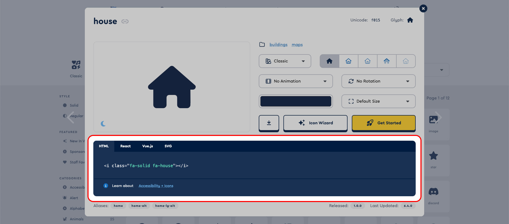

# DNA Digital 360º - One-page site


Este é um site one-page desenvolvido como ferramenta de apoio à equipe comercial durante seus contatos de prospeção e negócios. Apresentando informações claras e objetivas sobre a empresa, o site descreve seu principal produto, seus benefícios, lista alguns clientes de renome, exibe exemplos de funcionalidades dos tours virtuais e fornece opções de contato conforme a região do visitante.

O site foi criado diretamente em `HTML` e `SASS`, devido ao seu conteúdo predominantemente estático. Conteúdos como clientes, benefícios, funcionalidades e equipe comercial são armazenados em um arquivo `JSON` e exibidos na página inicial utilizando iterações em `Javascript`, já que possuem o mesmo padrão estrutural de conteúdo. Assim, torna-se mais ágil e fácil para alterar, inserir ou remover conteúdos destas categorias.

<sub>Tecnologias utilizadas: `HTML`, `SASS`, `Javascript`, `JSON` e `Font Awesome`.</sub>

--

Acesse o [Live Preview](https://dnadigital360.netlify.app)

<sub>*Obs.: as informações de consultores e contatos (nomes, fotos etc.) são genéricas, já que este é um link apenas para visualização do projeto.*</sub>

--

## 📚 Índice

* [Editar, inserir ou remover de conteúdo](#editar-inserir-ou-remover-de-conteúdo)
  * [Conteúdos com a mesma estrutura padrão](#conteúdos-com-a-mesma-estrutura-padrão)
    * [Clientes](#clientes)
    * [Benefícios](#benefícios)
    * [Funções](#funções)
    * [Equipe comercial](#equipe-comercial)
  * [Editar o arquivo `content.json`](#editar-o-arquivo-contentjson)
  * [Obter classes para ícones (Font Awesome)](#obter-classes-para-ícones-font-awesome)
* [Inserir ou configurar animação durante rolagem](#inserir-ou-configurar-animação-durante-rolagem)
* [Inserir ou configurar contador ao exibir em tela](#inserir-ou-configurar-contador-ao-exibir-em-tela)
* [Alterar estilos](#alterar-estilos)

## Editar, inserir ou remover de conteúdo

A maior parte do conteúdo está inserido de forma estática dentro do arquivo `index.html`. As alterações devem ser realizadas diretamente neste arquivo.

Caso a intenção seja editar conteúdos que possuem uma repetição de padrão, deve ser realizada conforme descrito na seção abaixo.

### Conteúdos com a mesma estrutura padrão

A edição de conteúdo com estrutura padrão repetida, como **Clientes**, **Benefícios**, **Funções** ou **Equipe Comercial**, deve ser feita no arquivo `content.json`, no diretório `assets/js`. Cada categoria deve seguir o padrão estrutural representado abaixo:

#### Clientes

```json
{
  "name": "Nome da empresa",
  "logo": "Diretório da imagem",
  "url": "URL principal da empresa"
}
```

#### Benefícios

```json
{
  "title": "Título do benefício",
  "text": "Descrição do benefício.",
  "icon": "Classes do ícone fornecidas pelo Font Awesome"
}
```

#### Funções

```json
{
  "name_short": "Título exibido no menu lateral/seletor",
  "name_full": "Título exibido na área principal, abaixo da imagem",
  "description": "Descrição da função.",
  "image": "Diretório da imagem",
  "icon": "Classes do ícone fornecidas pelo Font Awesome"
}
```

#### Equipe Comercial

```json
{
  "name": "Nome do(a) consultor(a)",
  "role": "Região de atuação, UF",
  "image": "Diretório da imagem",
  "mail": "mailto:nome@dnadigital360.com.br",
  "whatsapp": "URL gerada pelo WhatsApp para direcionamento"
}
```

### Editar o arquivo `content.json`

O arquivo `content.json` deve seguir exatamente o padrão estrutural conforme apresentado acima. Caso contrário, ocasionará erro durante a exibição do conteúdo na página principal.

Cada bloco entre `{` e `}` é considerado como um elemento. Insira uma vírgula (`,`) após a `}` que fecha este elemento, exceto quando este for o último da categoria.

Em cada elemento, há uma *chave* e um *valor*. Ambos devem ser encapsulados dentro de aspas (`" "`) e separados por dois pontos (`:`). Ao final de cada linha, insira uma vírgula (`,`), exceto quando esta for a última deste elemento.

*Obs.: a chave (palavra antes de `:`) **NÃO** deve ser alterada.*

## Obter classes para ícones (Font Awesome)

Para adicionar os ícones nos elementos, copie as classes contidas no atributo `class=" "` fornecidas pela Font Awesome, na aba `HTML`.

### *Exemplo*



> De acordo com a marcação `HTML` do ícone selecionado acima (`<i class="fa-solid fa-house"></i>`), as classes que devem ser copiadas são: `fa-solid fa-house`. *Obs.: mantenha o espaço entre as classes*

## Inserir ou configurar animação durante rolagem

Para animar um elemento durante sua aparição em tela, inclua os seguintes atributos em sua tag `HTML`:

| Atributo              | Opções                            |
| :-------------------- | :-------------------------------- |
| `data-animate`        | fade-top, fade-left ou fade-right |
| `data-animate-delay`* | De 0 a 10, *sendo 1 = 100ms*      |

<sup>**opcional*</sup>

### *Exemplo*

```HTML
  <div data-animate="fade-top" data-animate-delay="5">Elemento animado</div>
```

> Este elemento será exibido com a animação "fade-top", com 500ms de espera após a rolagem da tela chegar em sua posição.

## Inserir ou configurar contador ao exibir em tela

Para inserir ou alterar um contador que inicia-se ao ser exibido em tela, adicione os seguintes atributos em sua tag `HTML`:

| Atributo             | Opções                       |
| :------------------- | :--------------------------- |
| `data-counter`       | Valor final do contador      |
| `data-counter-speed` | De 0 a 1000, *sendo 1 = 1ms* |

*Obs.: inclua também o número final do contador dentro da tag `HTML`, conforme o exemplo abaixo.*

### *Exemplo*

```HTML
  <div data-counter="250" data-counter-speed="5">250</div>
```

> Ao ser exibido em tela, o contador iniciará a contagem de 0 à 250, aumentando 1 número a cada 5 milissegundos.

## Alterar estilos

*Primeiro, é necessário ter o `SASS` instalado em sua máquina ou no repositório local onde está trabalhando.*

Realize as alterações de estilo no arquivo `input.scss`, dentro da pasta `dev`. Para facilitar o acompanhamento das alterações, execute o comando abaixo antes de iniciar:

```sass
sass --watch dev/input.scss assets/style.css
```

*Ele irá atualizar o arquivo `style.css` a cada alteração no `input.scss` salva.*

---

<sub>Desenvolvimento completo por Juliano Sill.</sub>
